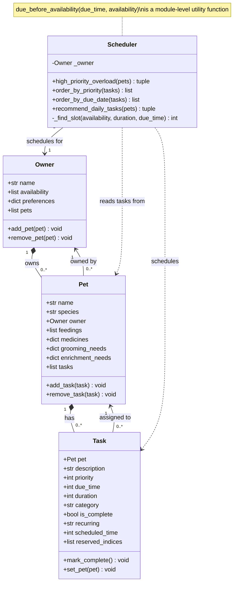

# PawPal+ (Module 2 Project)

**PawPal+** is a Streamlit app that helps a pet owner plan care tasks for their pet(s).

## Scenario

A busy pet owner needs help staying consistent with pet care. They want an assistant that can:

- Track pet care tasks (walks, feeding, meds, enrichment, grooming, etc.)
- Consider constraints (time available, priority, task duration, and owner preferences)
- Produce a daily plan 

## What PawPal+ Accomplishes

The app allows the owner(s) to:

- Let a user enter basic owner + pet info
- Let a user add/edit tasks (duration + priority at minimum)
- Generate a daily schedule/plan based on constraints and priorities
- Display the plan clearly (and ideally explain the reasoning)
- Include tests for the most important scheduling behaviors

## Getting started

### Setup

```bash
python -m venv .venv
source .venv/bin/activate  # Windows: .venv\Scripts\activate
pip install -r requirements.txt
```

## Features

### Scheduling Logic (`pawpal_system.py`)

- **Minute-resolution availability** — owner availability is stored as a 1440-element int array (one slot per minute of the day), where `0` = unavailable, `1` = free, and `2` = reserved by a scheduled task.
- **Greedy slot-fitting scheduler** (`Scheduler.recommend_daily_tasks`) — sorts all incomplete tasks by priority → due time → owner preference match, then assigns each task to the earliest contiguous block of free minutes that ends at or before the task's due time. Assigned minutes are flipped from `1` → `2` so later tasks cannot double-book the same time.
- **First-fit slot search** (`Scheduler._find_slot`) — scans the availability array left-to-right tracking runs of `1`s. Returns immediately once a run long enough to fit the task's duration is found within the due time. Also early-exits if the current run already starts too late, since all later runs will be later still.
- **High-priority overload detection** (`Scheduler.high_priority_overload`) — sums the total duration of all incomplete high-priority tasks and compares it against the owner's total available minutes, returning the pair if demand exceeds supply.
- **Priority and due-time sorting** (`Scheduler.order_by_priority`, `Scheduler.order_by_due_date`) — standalone sort helpers used independently of the full scheduler.
- **Due-time conflict check** (`due_before_availability`) — module-level utility that returns `True` if a task's due time falls before the owner's first available minute, catching unschedulable tasks before they enter the scheduler.
- **Bidirectional Owner ↔ Pet linking** (`add_pet` / `remove_pet`) — keeps `owner.pets` and `pet.owner` in sync on both sides.
- **Bidirectional Pet ↔ Task linking** (`add_task` / `remove_task`, `Task.set_pet`) — keeps `pet.tasks` and `task.pet` in sync, including correctly moving a task between pets.

### UI & Data Management (`app.py`)

- **Owner management** — add, edit, and delete owners; deleting an owner cascades to remove all their pets and tasks.
- **30-minute block availability picker** — owners select availability via a multiselect of 30-min blocks displayed in 12-hour format; internally converted to and stored as the 1440-element array.
- **Owner task-type preferences** — owners declare preferred activity types; the scheduler uses these to break ties within the same priority and due-time bucket.
- **Pet management** — add, edit, and delete pets per owner with species, comma-separated medications, and daily grooming/enrichment completion flags; deleting a pet cascades to remove its tasks.
- **Task management** — add, edit, and delete tasks with title, category, due time, duration, priority, and an optional recurrence cadence (Daily / Weekly / Monthly).
- **Task list sorting and filtering** — sort the task table by Due Time or Priority; filter by completion status (All / Incomplete / Complete) and by one or more pets.
- **Due-time conflict prevention** — blocks saving a task whose due time is earlier than the owner's first available minute, surfacing a toast warning with the exact times.
- **Task completion with slot release** — checking a task complete frees its reserved availability slots (`2` → `1`) so the time becomes available to other tasks in the same session.
- **Automatic recurring task generation** — when a recurring task is marked complete, a new copy is appended to the task list with its due date advanced by the appropriate delta (1 day / 7 days / 30 days) and its schedule state reset.
- **Schedule generation UI** — builds live `Owner`, `Pet`, and `Task` objects from session state, runs the full scheduler, then displays scheduled and unscheduled tasks in separate tables alongside summary metrics (tasks scheduled, total time, available time).
- **High-priority overload toast** — warns the user before displaying the schedule if high-priority task demand exceeds the owner's available minutes.
- **JSON persistence** — all owners, pets, and tasks are saved to `pawpal_data.json` on every mutation and reloaded on startup.
- **Legacy data migration** — automatically converts any saved availability data stored in the old 30-min-block-list format to the current 1440-array format on load.

---

## UML Diagram


## Testing PawPal+

Run the command python -m pytest to run all 8 tests outlined in tests/text_pawpal.py

- Test #1: Selecting complete checkbox marks tasks as completed 
- Test #2: Adding a task to a pet increases that pet's task count
- Test #3 (3 tests): Completed tasks are excluded from daily schedule
- Test #4 (3 tests): Task are sorted in the given order: priority → due_time, and owner preference

## Demo

Creating using Screen2Gif for Windows 


